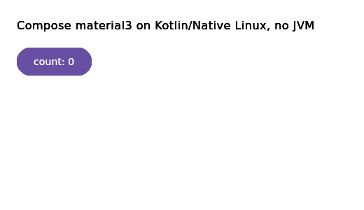
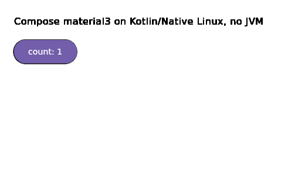
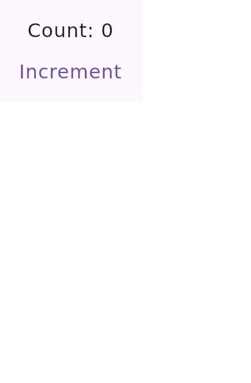

# skip-compose-native-linux

Running declarative UI, **Compose Multiplatform** and **SwiftUI transpiled by [Skip](https://skip.dev)**,
on **Kotlin/Native Linux, without a JVM**.

> English canonical (this file). French copy: [`README.fr.md`](./README.fr.md).

A series of six research probes into the UI layer for a constrained Linux device.
They answer one question end to end: *can Jetpack Compose / Compose Multiplatform render on a
Linux device without paying the JVM cost, and at what price?* The answer, measured on Linux arm64:
**yes**, a real `MaterialTheme` + `Button` + `Text` renders and reacts on **Kotlin/Native Linux with
no JVM**, in a **35 MB** self-contained binary using **124 MB** RSS, versus **137 MB / ~224 MB** for
the equivalent Compose Desktop (JVM) app.

POC 6 reopens the one question POC 1 had closed as NO-GO: whether Skip's SwiftUI-transpiled UI can be
de-Android-ified onto Compose Multiplatform. It is **done** on both targets: first CMP Desktop (JVM), then
**Kotlin/Native Linux with no JVM**, where the whole transpiled Skip stack (371 files) compiles green and
the transpiled SwiftUI screen renders natively, at **37 MB / 122 MB RSS** versus **137 MB / 224 MB** on the
JVM.

| Before (count 0) | After a click (count 1) |
|---|---|
|  |  |

*The real material3 `Button`, laid out and hit-tested by the real JetBrains `ComposeScene`, rendered by
skiko GL into a GLFW window, on Kotlin/Native Linux arm64, no JVM. Software rendering (Xvfb / llvmpipe).*

## The six POCs

Each POC has its own findings document (English + French), kept as the real deliverable.

| # | POC | Verdict | Findings |
|---|---|---|---|
| 1 | Skip (SwiftUI transpiled) to Compose Multiplatform desktop Linux | NO-GO on a transpiler; go Compose-first | [`FINDINGS.md`](./FINDINGS.md) |
| 2 | Compose-first native, and the mobile ARM reality | GO Compose-first; but CMP Desktop is JVM-only (137/224 MB) | [`FINDINGS-POC2.md`](./FINDINGS-POC2.md) |
| 3 | The K/N Linux foundation (skiko + runtime + GLFW windowing) | GO: the foundation exists, no JVM (21.5 MB Skia rectangle) | [`FINDINGS-POC3.md`](./FINDINGS-POC3.md) |
| 4 | A minimal hand-written `ui-glfw` (interactive UI, no JVM) | Approach proven viable (24 MB); not the real compose.ui | [`FINDINGS-POC4.md`](./FINDINGS-POC4.md) |
| 5 | The **real** compose.ui / foundation / material3 on K/N Linux | DONE: rendered + interactive, 35 MB / 124 MB, no JVM | [`FINDINGS-POC5.md`](./FINDINGS-POC5.md) |
| 6 | De-Android-ify Skip's transpiled SkipUI, on CMP Desktop (JVM) then Kotlin/Native Linux | DONE: the whole Skip stack compiles green AND the transpiled SwiftUI screen renders on K/N Linux, no JVM (37 MB / 122 MB vs 137/224 JVM) | [`FINDINGS-POC6.md`](./FINDINGS-POC6.md) |

> Every probe has a one-command runner, and `scripts/setup.sh` prepares a fresh clone. See the
> [Reproduce](#reproduce) section below, or [`scripts/README.md`](./scripts/README.md) for the full matrix.

## How POC 5 works

Two pieces, no fork of Compose required:

1. **Extract-and-compile (route A2).** The real `compose.ui`, `foundation`, `material3` (and their
   dependencies) are compiled for the `linuxArm64` Kotlin/Native target **from a source checkout of
   [JetBrains/compose-multiplatform-core](https://github.com/JetBrains/compose-multiplatform-core)**,
   against the **published** klibs of the pieces JetBrains already ships for K/N Linux (skiko, compose
   runtime, lifecycle, savedstate, collection, annotation). The platform surface that needs Linux
   `actual`s is small and enumerable (see the POC 5 findings); a couple are stubbed (clipboard, the
   DatePicker i18n layer).
2. **A `ui-glfw` mediator (~180 lines).** It drives the real `ComposeScene` (`CanvasLayersComposeScene`
   + `FrameRecomposer` + a `PlatformContext`) into a GLFW window through a skiko GL surface, feeding it
   pointer events and running one Compose frame per iteration
   (`performFrame` -> `measureAndLayout` -> `draw`).

The only runtime platform wall hit was `compose.ui#postDelayed` (used by `RectManager`'s debounce),
which launches on `Dispatchers.Main`, absent on K/N Linux. It is replaced by a frame-loop-drained
scheduler that runs the callbacks on the compose thread.

## How POC 6 works (the Skip transpiler question, reopened)

POC 6 reopens the one question POC 1 closed as NO-GO: is Skip's SwiftUI-transpiled SkipUI/SkipFoundation
"diffusely coupled to Android", or is the coupling bounded and shimmable? It answers it on two targets:
first **CMP Desktop (JVM)** (`poc6-skip-cmp/`, below), then **Kotlin/Native Linux with no JVM**
(`poc6-native/`), where the whole Skip stack both compiles and renders.

The method is POC 5's ("provide the platform actuals"), applied to Skip: keep all four transpiled Skip
modules whole (SkipLib / SkipFoundation / SkipModel / SkipUI, ~369 files), and fill the Android surface
with (a) published libraries (coil3, okhttp, commonmark, material-icons-extended), (b) `android.jar`
compile-only for the `android.*` surface, (c) the one androidx that has a JVM variant (`navigation3`,
compile-only non-transitive so its compose refs bind to CMP), and (d) ~24 hand-written shim files under
[`poc6-skip-cmp/src/main/kotlin/shims/`](./poc6-skip-cmp/src/main/kotlin/shims/).

The error count converges monotonically to zero (1348 -> 535 -> 347 -> 136 -> 107 -> 33 -> 15 -> 3 -> 0,
`BUILD SUCCESSFUL`); the residual was library-version skew, not Android coupling. The transpiled SwiftUI
`ContentView` then renders through the real SkipUI into a PNG, no Android:

| POC 6 render (CMP Desktop, no Android) |
|---|
|  |

*A SwiftUI `Text` ("Count: 0") and a material3 `Button` ("Increment"), transpiled by Skip and rendered by
the real SkipUI on Compose Multiplatform Desktop, offscreen via `ImageComposeScene`. The verdict: POC 1's
"diffuse / hopeless" framing does not hold; the coupling is a countable, localized set of shims.*

### POC 6 on Kotlin/Native Linux, no JVM (`poc6-native/`)

The same transpiled Skip stack was then pushed all the way to K/N Linux, on top of the from-source compose
stack of POC 5. The whole thing (SkipLib + SkipFoundation + SkipModel + SkipUI + the transpiled Witness app,
371 files) compiles green, links to a **37 MB** release binary, and the transpiled SwiftUI `ContentView`
**renders natively**, no JVM:

| POC 6 render (Kotlin/Native Linux, no JVM) |
|---|
|  |

*The same "Count: 0" / "Increment" screen, now 100% native: transpiled SwiftUI -> real SkipUI -> real
ComposeScene -> skiko GL, in a GLFW window on Kotlin/Native Linux arm64, no JVM. **37 MB / 122 MB RSS**,
versus **137 MB / 224 MB** for the equivalent Compose Desktop (JVM) app.*

Since K/N has no `java.*`, the port provides the `java.*` / `android.*` / third-party API surface Skip calls
as compile-only shims (the `android.jar` approach turned on the JDK): **115 shim files (~4300 lines)** across
40+ packages, plus a functional slice for the runtime (a desktop `Context`, an RFC 3986 `java.net.URI`, real
time via posix, `BigInteger` on the ionspin bignum, ...). The findings document the full trajectory
(2103 -> 0 for the foundation, 1500 -> 0 for the UI) and the ~10 runtime fixes to first render.

## Reproduce

`./export` (Skip's transpiled output) and `./.cmc` (the Compose source checkout) are not committed;
`scripts/setup.sh` regenerates them for a fresh clone: it fetches the dependencies, runs `skip export` on
the witness app, then de-Android-ifies it with `scripts/patch-export.sh`. Then run any probe:

| Probe | Command |
|-------|---------|
| POC 1: Skip output on CMP Desktop (JVM) | `scripts/run-jvm.sh desktop-witness` |
| POC 2: Compose-first, on a real screen | `scripts/run-poc2-screen.sh` |
| POC 3: Skia + runtime + GLFW, native | `scripts/run-native.sh poc3-native` |
| POC 4: minimal ui-glfw, native | `scripts/run-native.sh poc4-native` |
| POC 5: real material3, native | `scripts/run-native.sh poc5-native` |
| POC 6: transpiled SkipUI, native (no JVM) | `scripts/run-native.sh poc6-native` |
| POC 6: transpiled SkipUI on CMP Desktop (JVM) | `scripts/run-jvm.sh poc6-skip-cmp` |

Prerequisites (a JDK, Docker, the Skip toolchain), overrides and the full matrix are in
[`scripts/README.md`](./scripts/README.md).

Two things worth flagging: the published K/N Linux klibs the native builds consume are pinned to
leading-edge (alpha/beta/rc) versions, since that is the only place the `linuxArm64` variants exist during
the rollout (the findings record the exact versions); and Skip's transpiled Kotlin is not ours to
redistribute, which is why `setup.sh` regenerates it locally instead of the repo shipping it.

## Status and caveats

- **Rendering is software** (llvmpipe under Xvfb). GPU smoothness and the memory profile on real
  hardware are not yet confirmed.
- The cost of this approach is **maintaining an out-of-JetBrains `ui-glfw` backend** plus a handful of
  Linux `actual`s, for as long as JetBrains has not published the UI layer's K/N Linux artifacts. Once
  they do, the extract-and-compile scaffolding collapses to just the mediator.
- These are **exploratory research probes**, not production-hardened. Read the findings for the honest cost accounting.

## References

- Compose Multiplatform: https://kotlinlang.org/compose-multiplatform/
- compose-multiplatform-core: https://github.com/JetBrains/compose-multiplatform-core
- skiko (Skia for Kotlin): https://github.com/JetBrains/skiko
- GLFW: https://www.glfw.org/

The skiko Kotlin/Native Linux arm64 support this project rides on:

- [skiko#1051](https://github.com/JetBrains/skiko/pull/1051) "Add linuxArm64 target" (merged Jun 2025): adds the cross-compiled skiko linuxArm64 klib this project consumes.
- EGL on linuxArm64, tracked by [SKIKO-918](https://youtrack.jetbrains.com/issue/SKIKO-918) / [skiko#918](https://github.com/JetBrains/skiko/issues/918) "Add EGL support" (**Fixed**): skiko now supports EGL on linuxArm64 via `makeGL()`. Landed through [skia-pack#68](https://github.com/JetBrains/skia-pack/pull/68) (merged Oct 2025) and [skiko#1052](https://github.com/JetBrains/skiko/pull/1052) (merged Jan 2026).
- [SKIKO-611](https://youtrack.jetbrains.com/issue/SKIKO-611) / [skiko#611](https://github.com/JetBrains/skiko/issues/611) "Support Kotlin/Native on Windows and Linux (x86_64)" (**open** on YouTrack): tracks the x86_64 desktop targets; per the thread, native desktop Linux/Windows is community-driven, not JetBrains-prioritized. The arm64 target this project uses came separately via skiko#1051.
- [SKIKO-863](https://youtrack.jetbrains.com/issue/SKIKO-863) / [skiko#863](https://github.com/JetBrains/skiko/issues/863) "Support for Linux DRM" (**open**): direct KMS/DRM rendering with no window manager, relevant to headless/embedded devices. Prior art in the thread: Jake Wharton's [composeui-lightswitch](https://github.com/JakeWharton/composeui-lightswitch) got Compose running on DRM.

## License

Apache License 2.0. See [`LICENSE`](./LICENSE) and [`NOTICE`](./NOTICE). This repository includes source
files copied (and a few patched) from the Apache-2.0 licensed AOSP / JetBrains Compose projects, under
`poc5-native/src/linuxArm64Main/` and (the same set) `poc6-native/src/linuxArm64Main/`, each retaining its
original header. The `NOTICE` file records the attribution and the modifications. The `poc6-skip-cmp/` and
`poc6-native/` shims are original work; Skip's transpiled output is not included in this repository (see
"Reproduce"). Everything else is original work.
